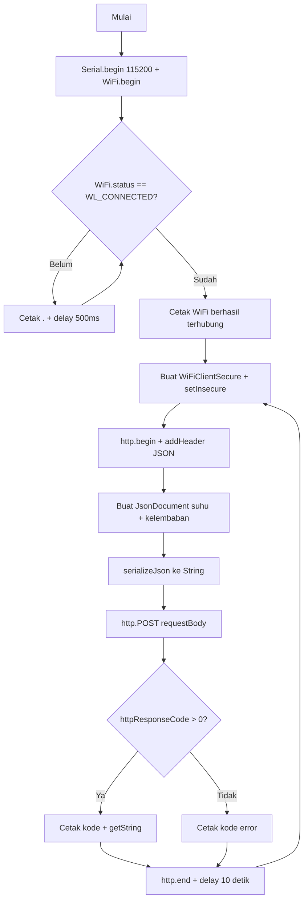

# Jawaban Pertanyaan Percobaan 3A

## Soal 1: Gambarkan diagram alur (flowchart) proses pengiriman data melalui HTTP POST pada program di atas!

**Jawaban:**

## Soal 2: Apa fungsi dari perintah http.addHeader("Content-Type", "application/json") pada program tersebut?

**Jawaban:**
Memberitahu server bahwa data yang dikirim berformat JSON. Tanpa header ini, server mungkin tidak bisa membaca data dengan benar.

## Soal 3: Jelaskan arti dari kode response HTTP 200 dan sebutkan salah satu contoh kode response HTTP lain beserta artinya!

**Jawaban:**

- **200 (OK):** Request berhasil diterima dan diproses server tanpa error.
- Contoh lain **404 (Not Found):** Server tidak menemukan URL/endpoint yang diminta.

## Soal 4: Modifikasi program agar ESP32 dapat mengirimkan data tambahan berupa waktu (dalam milidetik sejak dinyalakan menggunakan millis()) ke dalam JSON yang dikirim, dan berikan penjelasan di setiap baris kode yang ditambahkan dalam bentuk README.md

**Jawaban:**
Ditambahkan `doc["waktu_ms"] = millis();` untuk menyisipkan waktu uptime (milidetik sejak ESP32 menyala). Ini membuat data JSON memiliki 3 field (`suhu`, `kelembaban`, `waktu_ms`), sehingga server tahu kapan data diambil.

[Perubahan Kode Percobaan 3A](Percobaan3AMod.ino)
