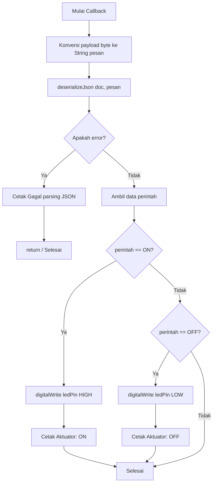

# Jawaban Pertanyaan Percobaan 4A

## Soal 1: Gambarkan diagram alur (flowchart) proses penerimaan dan pemrosesan pesan pada fungsi callback di atas!

**Jawaban:**

## Soal 2: Apa yang akan terjadi apabila pesan yang dipublikasikan bukan merupakan format JSON yang valid?

**Jawaban:**
Apabila pesan yang dipublikasikan bukan berupa JSON yang valid, proses deserialisasi `deserializeJson(doc, pesan)` akan menghasilkan error (gagal). Kondisi `if (error)` akan terpenuhi, lalu program akan mencetak pesan "Gagal parsing JSON:" ke Serial Monitor diikuti dengan keterangan error-nya, dan proses pengendalian aktuator tidak akan dijalankan karena ada statement `return;` setelahnya.

## Soal 3: Jelaskan mengapa fungsi client.subscribe() dipanggil di dalam fungsi hubungkanMQTT(), bukan di dalam setup()!

**Jawaban:**
Karena koneksi ke broker MQTT bisa saja terputus akibat gangguan jaringan. Jika ESP32 terputus lalu berhasil terhubung kembali, `hubungkanMQTT()` akan mengeksekusi ulang `client.subscribe()` untuk mendaftarkan topic kembali. Jika diletakkan di `setup()`, topic hanya di-subscribe sekali, dan ESP32 tidak akan merespons pesan jika koneksi sempat terputus dan tersambung lagi.

## Soal 4: Modifikasi program agar data JSON yang diterima juga memuat nilai intensitas (misalnya {"perintah": "ON", "intensitas": 200}) yang digunakan untuk mengatur kecerahan LED menggunakan PWM (analogWrite/ledcWrite), dan berikan penjelasan di setiap baris kode yang ditambahkan dalam bentuk README.md

**Jawaban:**
Penjelasan perubahan kode:
- Ditambahkan `int intensitas = 255;` sebagai nilai default (terang penuh).
- Ditambahkan blok `if (doc.containsKey("intensitas")) { intensitas = doc["intensitas"]; }` untuk mengambil nilai intensitas dari JSON (jika ada).
- Diubah fungsi aktuasi ke `analogWrite(ledPin, intensitas);` saat perintah ON dan `analogWrite(ledPin, 0);` saat perintah OFF, untuk menggunakan fitur sinyal PWM.

[Perubahan Kode Percobaan 4A](Percobaan4AMod.ino)
